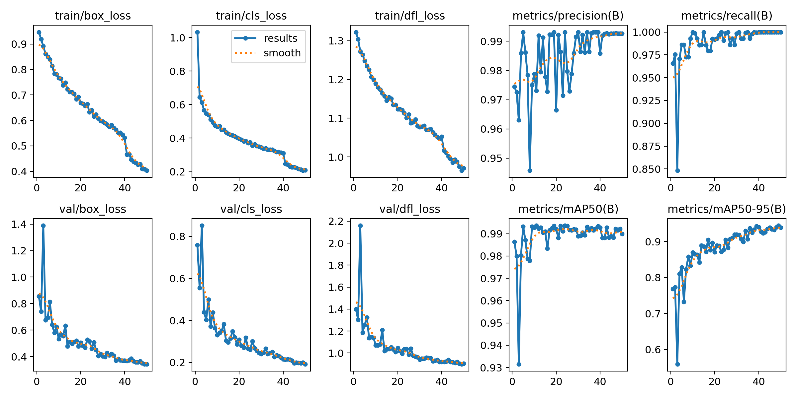
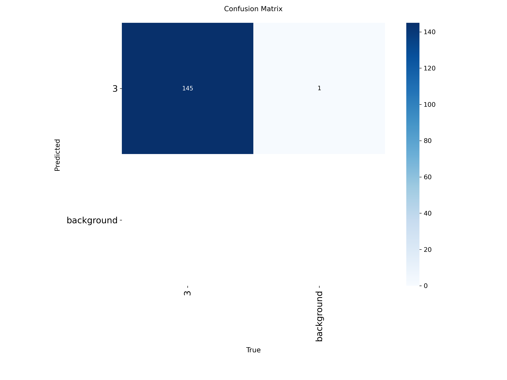
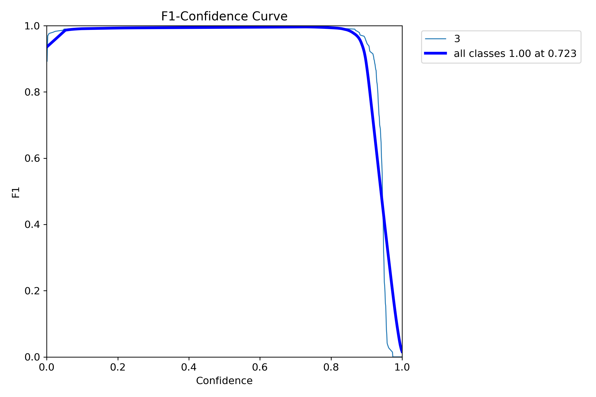

# Stop Sign Deep Learning

YOLOv8 (Ultralytics) ile STOP tabelası tespiti. Yıldız Rover Destek Ekip - Ödev 3.

## Klasör Yapısı

```
Stop_Sign_Deep_Learning/
├── train.py               # model eğitimi
├── test.py                # test seti üzerinde tespit
├── download_dataset.py    # (opsiyonel) Roboflow'dan veri seti indirme
├── requirements.txt
├── datasets/
│   ├── stop_sign/         # Roboflow export (data.yaml, train/, valid/)
│   └── stop_sign_dataset/ # test görüntüleri (ödevle paylaşılan)
├── runs/train/            # eğitim çıktıları (grafikler, weights/best.pt)
└── results/predictions/   # test sonuç görselleri
```

## Kurulum

```bash
git clone https://github.com/<kullanici>/Stop_Sign_Deep_Learning.git
cd Stop_Sign_Deep_Learning
python -m venv venv
source venv/bin/activate        # Windows: venv\Scripts\activate
pip install -r requirements.txt
```

## Veri Seti

1. [Roboflow Universe - Stop Sign](https://universe.roboflow.com/sign-detection-h24ey/stop-sign-h0vwm) sayfasından **YOLOv8** formatında indir ve `datasets/stop_sign/` içine çıkar. (veya `python download_dataset.py`)
2. `datasets/stop_sign/data.yaml` içinde yolların doğru olduğundan emin ol:
   ```yaml
   train: train/images
   val: valid/images
   ```
3. Ödevle paylaşılan `stop_sign_dataset` klasörünü `datasets/stop_sign_dataset/` olarak koy.

## Kullanım

E�itim:
```bash
python train.py
# örnek: python train.py --epochs 100 --batch 8 --imgsz 640 --optimizer SGD
```

Test:
```bash
python test.py
# örnek: python test.py --conf 0.4
```

Sonuç görselleri `results/predictions/`, eğitim grafikleri `runs/train/` altına kaydedilir.

## Parametreler

| Parametre | Varsayılan | Anlamı |
|---|---|---|
| epochs | 50 | Modelin tüm eğitim verisini kaç kez göreceği |
| batch | 16 | Her ağırlık güncellemesinde kullanılan görüntü sayısı |
| imgsz | 640 | Görüntülerin yeniden boyutlandırıldığı kenar uzunluğu (px) |
| optimizer | AdamW | Ağırlıkları loss'a göre güncelleyen algoritma |
| lr0 | 0.001 | Başlangıç öğrenme oranı |
| patience | 15 | İyileşme olmazsa erken durdurma için beklenen epoch |
| conf (test) | 0.25 | Bu değerin altındaki güven skorlu tespitler gösterilmez |
| iou (test) | 0.45 | NMS'te üst üste binen kutuları elemek için eşik |

## Eğitim Sonuçları

YOLOv8n, 50 epoch, batch 16, imgsz 640, AdamW (Google Colab T4 GPU).

| Metrik | Değer |
|---|---|
| Precision | 0.993 |
| Recall | 1.000 |
| mAP50 | 0.990 |
| mAP50-95 | 0.939 |

### Eğitim grafikleri


### Confusion Matrix


### F1 Eğrisi


## Test Sonuçları

`stop_sign_dataset` üzerinde (conf=0.25, IoU=0.45): 5 görüntünün 5'inde STOP tabelası tespit edildi.


